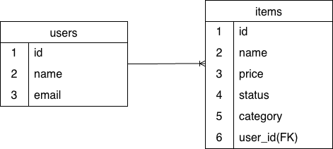
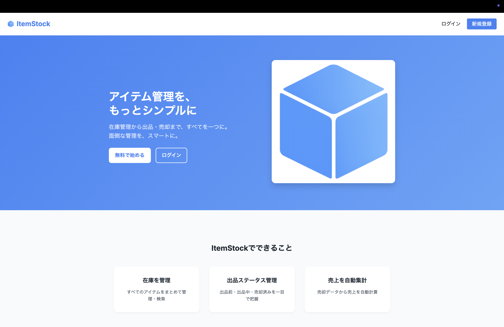
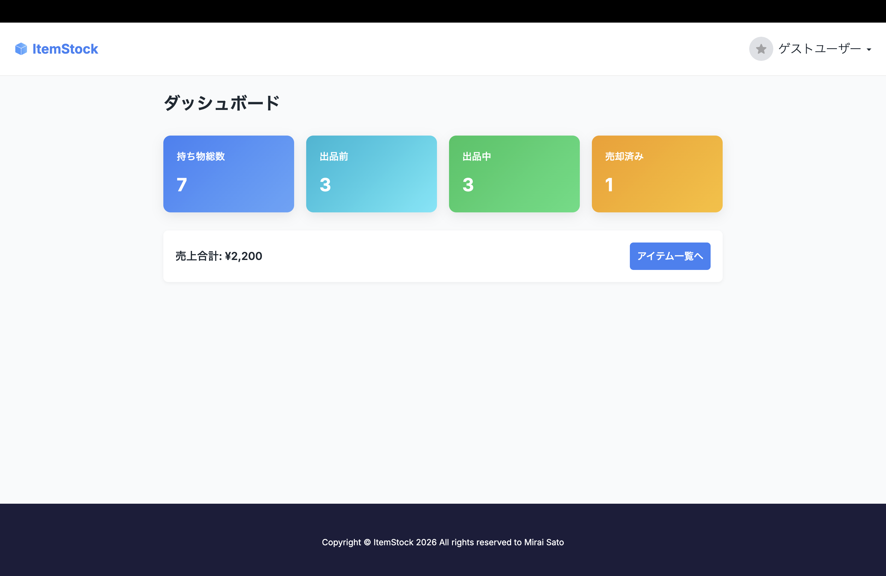
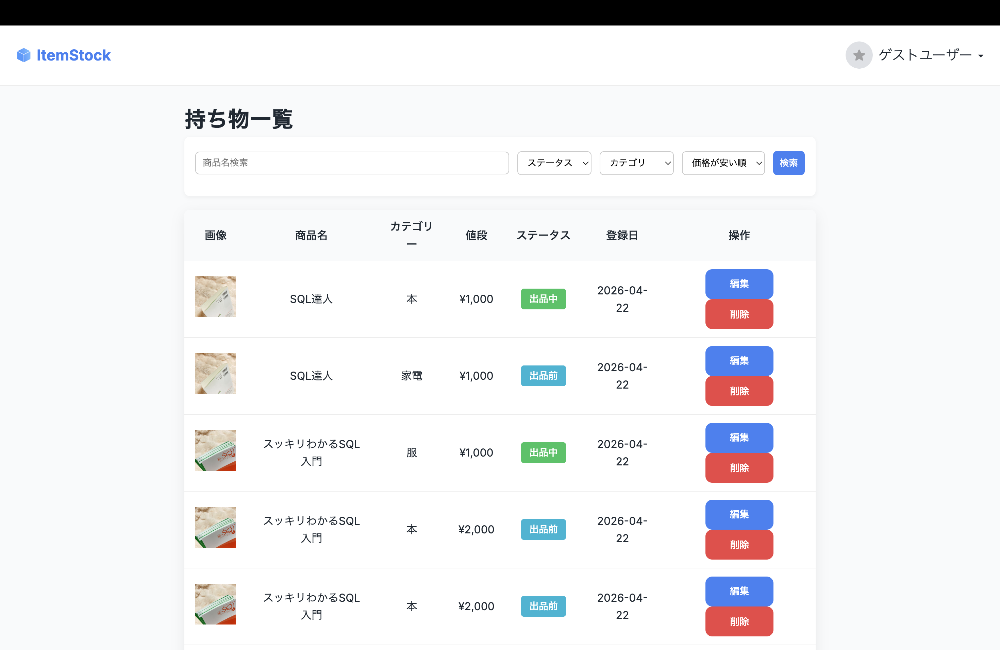
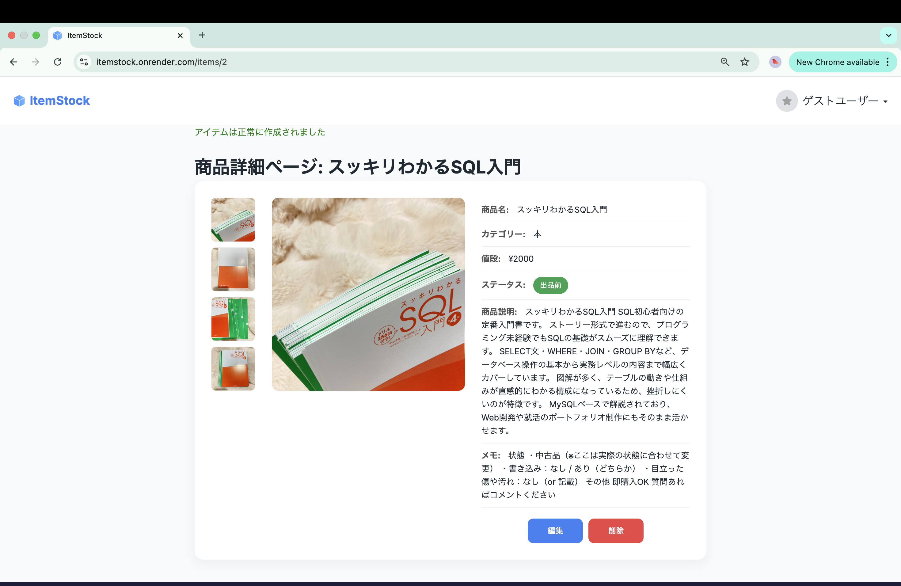
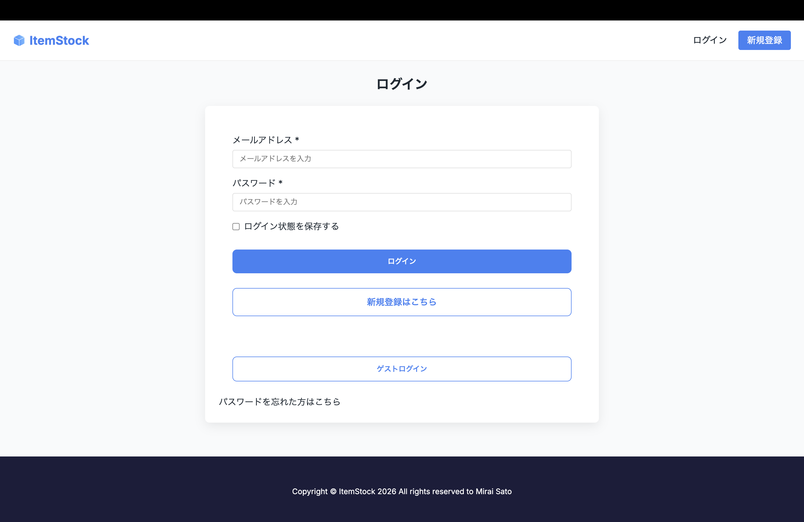

# ItemStock

フリマ出品を想定した**アイテム在庫・販売管理アプリ**です。
出品前・出品中・売却済みのステータスを一元管理し、売上や所有アイテムをシンプルに把握できます。

🔗 Live Demo  
https://itemstock.onrender.com/

## 🌐 アプリ概要

ItemStock は、個人でフリマアプリを利用する際に発生する

* 在庫の把握ができない
* 出品状況が分からなくなる
* 売却履歴を管理しづらい

といった課題を解決するために開発しました。

「アイテム管理を、もっとシンプルに」をコンセプトに設計しています。


## 主な機能

### 🔐 ユーザー機能

* ユーザー登録 / ログイン（Devise）
* ゲストログイン
* プロフィール編集


### 📦 アイテム管理

* アイテムCRUD機能
* 画像アップロードにはRails ActiveStorageを使用し、
本番環境ではAmazon S3に保存する構成を採用
* メモ・詳細情報保存
* ステータス管理

  * 出品前
  * 出品中
  * 売却済み
    

### 📊 ダッシュボード

* 所有アイテム一覧表示
* ステータス別件数表示
* 売却状況の可視化
  
### ☁️ インフラ構成
本番環境はRender + AWS S3 + PostgreSQLで構成しています。

### 🎨 UI / UX

* シンプルで直感的なUI設計
* favicon / アプリアイコン実装


## 🛠 技術スタック

| Category        | Technology         |
| --------------- | ------------------ |
| Backend         | Ruby on Rails 7    |
| Authentication  | Devise             |
| Database        | PostgreSQL(本番環境)|
|                 | / SQLite3(開発環境) |
| Image Upload    | ActiveStorage      |
|                 | Amazon S3(本番環境) |         
| Frontend        | HTML / CSS         |
| Environment     | Docker             |
| Version Control | Git / GitHub       |


## 🧱 ER図



## 🚀 セットアップ方法

```bash
git clone https://github.com/miraisato-dev/ItemStock.git
cd ItemStock
bundle install
rails db:create db:migrate
rails s
```

ブラウザで以下にアクセス：

```
http://localhost:3000
```


## 👤 ゲストログイン

ログイン画面から **ゲストログイン** を利用することで、アカウント登録なしで機能を確認できます。


## 🎯 開発背景

フリマアプリ利用時に、出品状況や在庫管理が煩雑になる経験から、

* シンプルに管理できること
* 状態を一目で把握できること

を重視して開発しました。


## 💡 工夫した点

* ステータス管理を enum で実装し可読性を向上
* ダッシュボードで情報を一画面に集約
* 採用担当者が確認しやすいようゲストログインを実装
* シンプルで直感的に操作でき、一目で機能が理解できるUI設計を意識しました。

## 🔮 今後の改善予定

* テスト追加
* 入力コストの最小化としてバーコードスキャン機能(Google Books APIとの連携)
* 定型文テンプレート: 「裁断済み」「美品」など、状況に合わせた説明文を1タップで生成
* UI/UX改善
* ドラッグ＆ドロップによる画像並べ替え: 出品時に最適な順番へ直感的に操作可能に
* 通知機能追加
* AIによる価格提案機能
* 売上データのグラフ可視化
* 全体的なデザインの向上
* 登録時の速度が遅い

## 📸 スクリーンショット

* トップページ

* ダッシュボード

* アイテム一覧

* アイテム詳細

* ログイン画面



## 👨‍💻 作者

miraisato-dev
GitHub: https://github.com/miraisato-dev
